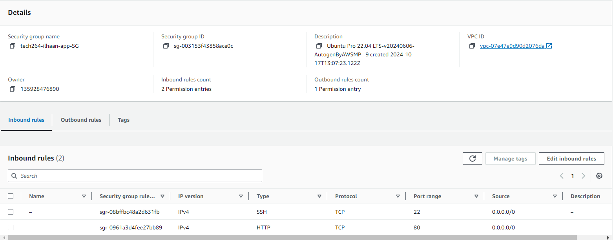

# ***Deploying App in 2-tier architecture on AWS***🌩️
- [***Deploying App in 2-tier architecture on AWS***🌩️](#deploying-app-in-2-tier-architecture-on-aws️)
  - [***How to:***](#how-to)
    - [***App and OS image***](#app-and-os-image)
    - [***Instance Type***](#instance-type)
    - [***Key Pair Login***](#key-pair-login)
      - [***If previously created...***](#if-previously-created)
    - [***Network Settings***](#network-settings)
    - [***Add Inbound Port Rules (Can be done after launch)***](#add-inbound-port-rules-can-be-done-after-launch)
    - [***Advanced details***](#advanced-details)
    - [**Review**](#review)
## ***How to:***
 
1. In the search bar, type **`EC2`** and select it.
2. Navigate to instances, then select **launch instances** on the right.
3. Input an appropriate name **`tech264-ilhaan-DB-ec2`**
 
### ***App and OS image***
1. Select **Ubuntu Server 22.04 LTS (HVM), SSD Volume Type**.
 
### ***Instance Type***
1. Make sure to select **t2.micro** for the instance type from the AMI Marketplace.
 
### ***Key Pair Login***
1. Create a new key pair.
2. Input the correct name **`tech264-ilhaan-aws-key`**
3. Select create and you will download your `.pem` key. This is the equivalent of a **private key** on **Azure**.
4. Move your private key from your downloads to your **`.ssh/`** folder
#### ***If previously created...***
1. Use an existing key.
 
### ***Network Settings***
1. Select **create security group**. Remember, you need a **UNIQUE** security group name for each VM, i.e: ***`tech264-ilhaan-DB-SG`***
2. Now you need to create inbound rules for your instances: allow **SSH** traffic for the **Database** EC2.
 

1. Allow **SSH** & **HTTP** for **App** EC2.
 

1. Create a new subnet. For the **Database**, make it **private**. For the **App**, make it **public**.
2. Edit IP for each one. Where in azure it was `10.0.1.0/24`, in AWS it is `172.31.1.0/24`. So you might want to use `172.31.2.0` for your **app**, and `172.31.3.0` for your **database**.
   1. This is an **optional** step, app should work with default subnets in default vpc
 
### ***Add Inbound Port Rules (Can be done after launch)***
1. Navigate to **Security Groups** under **Network and Security**.
2. Search for the NSG you wish to modify.
3. Select it.
4. Select **Edit inbound rules**.
5. For the DB EC2's inbound rules, you need to have a **Custom TCP** type rule with MongoDB's port range `27017`. You can select an NSG to only allow connections from THAT source. Better security.
 
### ***Advanced details***
1. Locate user data and input the relative data for the **EC2**.
2. This means the [app script](../scripting/prov-app.sh) and the [DB script](../scripting/dbscript.sh)
3. Change the IP address in your app script **`DB-HOST`** variable to point towards your databases private IP Address
 
### **Review**
1. Review your details then launch instance.
2. Copy your app's public IP to a new tab and check if your home page and /posts page are working (takes a few minutes)