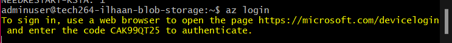

# ***Azure Fundamentals***
- [***Azure Fundamentals***](#azure-fundamentals)
    - [***The Basics of Azure*** ☁️](#the-basics-of-azure-️)
    - [***Azure Regions and Availability Zones*** 🗺️](#azure-regions-and-availability-zones-️)
    - [***How is Azure Structured/Organised?*** 📊](#how-is-azure-structuredorganised-)
    - [***What Types of Services Does Azure Provide?*** 🛜](#what-types-of-services-does-azure-provide-)
    - [***Ways to Access Azure*** 👩🏾‍💻](#ways-to-access-azure-)
    - [***Explain the Difference Between Azure and Azure DevOps?*** ♾️](#explain-the-difference-between-azure-and-azure-devops-️)
    - [***Why Use the Azure Pricing Calculator?*** 🧮](#why-use-the-azure-pricing-calculator-)
  - [***Downloading and using Azure CLI***](#downloading-and-using-azure-cli)
    - [***Using a blob storage account***](#using-a-blob-storage-account)

### ***The Basics of Azure*** ☁️
Azure is Microsoft’s cloud computing platform that provides a wide range of services, including computing power, storage, and networking. It enables businesses to build, deploy, and manage applications and services through Microsoft-managed data centers.

### ***Azure Regions and Availability Zones*** 🗺️
- **Regions**: Azure is divided into geographic regions, each containing one or more data centers. This allows users to deploy resources closer to their end users for better performance.
- **Availability Zones**: These are physically separate locations within a region that provide high availability and resilience. Each zone has independent power, cooling, and networking.
- Azure Front Door
Azure Front Door has 192 edge locations in 109 metro cities, plus 4 edge locations in 4 Azure US Government cloud regions.

[Azure Regions and Availability Zones](https://holori.com/list-of-all-azure-regions-and/)


### ***How is Azure Structured/Organised?*** 📊
Azure is organized into several key components:
- **Resource Groups**: Logical containers for managing and organizing related resources.
- **Subscriptions**: An agreement to use Azure services, providing access to resources and billing management. Every subscription has a limit/quota, eg: 50 VMs of the same size in the same region per subscription.
- **Management Groups**: A way to manage access, policies, and compliance across multiple subscriptions.

### ***What Types of Services Does Azure Provide?*** 🛜
Azure offers a variety of services, including:
- **Compute Services**: Virtual Machines, Azure Functions, App Services.
- **Storage Services**: Azure Blob Storage, Azure Files, Azure Disks.
- **Networking Services**: Azure Virtual Network, Azure Load Balancer, Azure VPN Gateway.
- **Databases**: Azure SQL Database, Cosmos DB, Azure Database for PostgreSQL.
- **Analytics**: Azure Synapse Analytics, Azure Data Lake, Azure Stream Analytics.
- **AI and Machine Learning**: Azure Machine Learning, Azure Cognitive Services.

### ***Ways to Access Azure*** 👩🏾‍💻
- **Azure Portal**: A web-based interface for managing Azure resources.
- **Azure CLI**: A command-line tool for scripting and automation.
- **Azure PowerShell**: A set of cmdlets for managing Azure resources using PowerShell.
- **REST APIs**: Programmatic access to Azure services via HTTP requests.

### ***Explain the Difference Between Azure and Azure DevOps?*** ♾️
- **Azure**: A comprehensive cloud computing platform providing infrastructure, platform, and software services.
- **Azure DevOps**: A suite of development tools for software teams, including Azure Repos, Azure Pipelines, and Azure Boards. It facilitates the development lifecycle, from planning to deployment.

### ***Why Use the Azure Pricing Calculator?*** 🧮
The Azure Pricing Calculator helps users estimate the cost of Azure services based on their specific needs and configurations. It allows users to:
- Compare costs of different services.
- Create pricing estimates for various scenarios.
- Make informed budgeting decisions for cloud resources.

## ***Downloading and using Azure CLI***
- **`curl -sL https://aka.ms/InstallAzureCLIDeb | sudo bash`** - to install the Azure CLI
- use ***`az --help`*** to see all the possible commands
- ***`az login`*** It should give you a link with a code to sign into Azure CLI
  
<br>


- Select the account you would like to login with (Sparta Account)
- Once you are logged in, you can close the window and return to your CLI
- It should retrieve your subscriptions
- It will ask you to select a subscription and tentant: we entered 1
- run the command `az group list` to list all the resource groups you are a part of.
  
```bash
#no hyphens in storage account name and change the resource group to tech264
az storage account create --name tech264ilhaanstorage --resource-group tech264 --location uksouth --sku Standard_LRS`***

#prints a JSON file that can be difficult to read
az storage account list --resource-group tech264

#this command converts that data into a table
az storage account list --resource-group tech264 --query "[].{Name:name, Location:location, Kind:kind}" --output table


# creates a storage container wwithin blob storage account named testcontainer
    az storage container create \
    --account-name tech264ilhaanstorage \
    --name testcontainer
# You may see a yellow line warning, but fear not! It will create the container anyway. We could add
#`--auth-mode login`
#to the end of the command to prevent this!

# you can use a `\` to break up the lines

# deletes a storage container
 az storage container delete \
    --account-name tech201ramonstorage \
    --name testcontainer
    --auth-mode login

# creates another storage container like the one we deleted
az storage container create --account-name tech264ilhaanstorage --name testcontainer --auth-mode login

# shows a list of containers in my storage account
az storage container list --account-name tech264ilhaanstorage --output table --auth-mode login


az storage blob upload \
    --account-name tech264ilhaanstorage \
    --container-name testcontainer \
    --name newname.txt \ #name of file in cloud 
    --file text.txt \ # name of file you eish to upload
    --auth-mode login

# checks your cloud for list of blobs
    az storage blob list \
    --account-name tech264ilhaanstorage \
    --container-name testcontainer \
    --output table \
    --auth-mode login
```


### ***Using a blob storage account***
[All about Blob storage](./blob-storage.md)