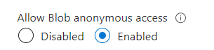

# ***BLOB STORAGE***

- [***BLOB STORAGE***](#blob-storage)
  - [***Creating a Blob Storage VM***](#creating-a-blob-storage-vm)
  - [***Making your blob storage file public***](#making-your-blob-storage-file-public)
    - [***Check the Blob on the Azure Portal***](#check-the-blob-on-the-azure-portal)
    - [***To make it public***](#to-make-it-public)

## ***Creating a Blob Storage VM***
1. Create a VM using our app image named ***`tech264-ilhaan-blob-storage`*** and the instructions here[Create a VM](/tech264-cloud-linux/cloud/create_virtual_machine.md), then add the [run app script](/tech264-cloud-linux/scripting/run-app-only.sh) to user data when creating your VM (dont need the DB_HOST env variable as we are not running/creating a database VM)
2. SSH into the VM using these instructions [SSHing into a VM](/tech264-cloud-linux/cloud/create_SSH_key.md)
3. Download and run the Azure CLI to create a blob storage account and test container here [Azure CLI](/tech264-cloud-linux/cloud/azure/README.md)
---
## ***Making your blob storage file public***
### ***Check the Blob on the Azure Portal***
- Go through your storage account: Azure Portal > ***`tech264ilhaanstorage`*** > Data storage > Containers > ***`testcontainer`*** > ***`newname.txt`*** > copy the URL. It should be **private**
 
### ***To make it public***
- Were going to change the access level to make it public
- Go to storage account
- (on the left) Settings > Configuration > Allow Blob anonymous access (enable) > click save

 

- Change access level > (left hand side) Data Storage > Containers > click on the container > change access to **`blob`** > click **`save`**.
- refresh and now copy the link into your browser and you should be able to see the contents of your file