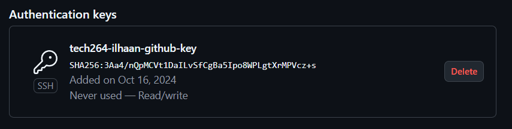
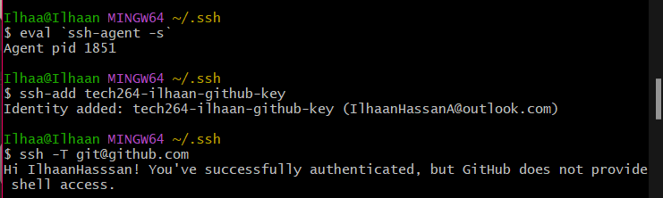
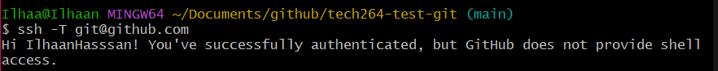
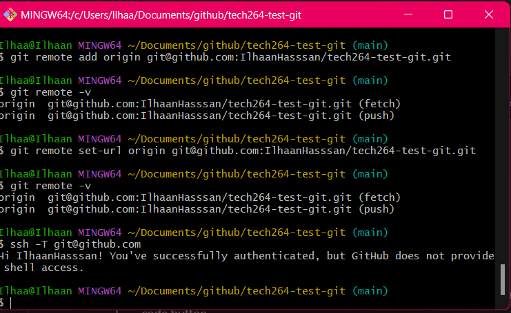

# ***SSH KEYS***
- [***SSH KEYS***](#ssh-keys)
  - [***SSH Key Generation and Usage***](#ssh-key-generation-and-usage)
    - [***Steps to Create an SSH Key***](#steps-to-create-an-ssh-key)
  - [***Add your SSH key to Azure portal***](#add-your-ssh-key-to-azure-portal)
  - [***Security Settings for SSH Key in Azure Portal***](#security-settings-for-ssh-key-in-azure-portal)
  - [***Use SSH authentication with a repo in GitHub***](#use-ssh-authentication-with-a-repo-in-github)
    - [***Step 1: Create SSH Key***](#step-1-create-ssh-key)
    - [***Step 2: Register your key on GitHub (padlock)***](#step-2-register-your-key-on-github-padlock)
    - [***Step 3: Add a private key to SSH register***](#step-3-add-a-private-key-to-ssh-register)
    - [***Step 4: Create a test repo on github***](#step-4-create-a-test-repo-on-github)
    - [***Step 5: push changes to test repo***](#step-5-push-changes-to-test-repo)
  - [***How to convert an existing repo from HTTPS to SSH***](#how-to-convert-an-existing-repo-from-https-to-ssh)

## ***SSH Key Generation and Usage***
This guide outlines the steps to create and manage SSH keys, as well as how to add the public key to the Azure portal.

### ***Steps to Create an SSH Key***

1. Navigate to the Home Directory:
- Open a terminal or command line and cd into home directory
```bash
cd .
```
2. Check for an Existing **`.ssh`** Folder
The **`.ssh`** directory stores SSH keys and configurations.
```bash
ls -a
```
- This should show you all files including the hidden . files like .ssh/ and .git/
3. If it doesn't exist, you can create it using 
```bash 
mkdir .ssh
```
4. **`-cd`** into the .ssh folder
5. use **`pwd`** to check this: output should be **`/c/Users/<home_directory_name/.ssh>`**
6.  Run command: **`ssh-keygen -t rsa -b 4096 -C "your_email"`** your key pair.
- **`-t rsa`**: Specifies that the RSA algorithm will be used.
- **`-b 4096`**: Sets the key size to 4096 bits for better security.
- **`-C "youremail@hotmail.com"`**: Adds a comment (your email) to help identify the key
7. You will get a prompt: **`Enter file in which to save the key: `**
8. Specify a custom file name for your key:  **`tech264-ilhaan-az-key`**
9. It will ask for a passphrase: you can just press enter for an empty passphrase
10.  Output should be:
```bash
Your identification has been saved in /Users/<your_home_directory>/.ssh/tech264-ilhaan-az-key.
Your public key has been saved in /Users/<your_home_directory>/.ssh/tech264-ilhaan-az-key.pub. 
```

11.   To print the content of your public key to the terminal **`cat tech264-ilhaan-az-key.pub`** *Ensure it is your PUBLIC key which is the file ending in **`.pub`**
    

## ***Add your SSH key to Azure portal***

1.  Log in to your Azure Portal (using Sparta Global credentials)
2.  Type ***"SSH Keys"*** into search bar
3.  Name your SSH key to reflect the name in your local machine
4.  Paste your long SSH key(output of **`cat`** command) from the terminal into the SSH key box in Azure
5.  Ensure you have selected the correct resource group, location and formation eg: 
   ***'tech264', UK South, RSA***

## ***Security Settings for SSH Key in Azure Portal***
- You don't want just anyone attempting to SSH into your machine.
- Your PublicIP will change if you switch off your Wi-Fi router so you will have to reset.
1. Log into Azure Portal
2. Find your VM's netwrok security group
3. Find your inbound port rules
4. change SSH source from "Any" to "My IP Address"
- Organisations usually use Bastion servers in production
- In a low-use production server, you can deny access to avoid security risks. 
- 
## ***Use SSH authentication with a repo in GitHub***
<br>

### ***Step 1: Create SSH Key***
- outlined above 
### ***Step 2: Register your key on GitHub (padlock)***
1. Log into Github
2. Click your profile picture and navigate to ***`settings`***
3. Select ***`SSH and GPG Keys`***
4. Select ***`Add SSH Key`***
5. Name your key to refelct the name on your local machine, i.e: ***`tech264-test-ssh`***
6. Do the ***`cat <key-name>.pub`*** command to paste your **public** key into the text box
7. Add your key and it should refkect read and write access:
 


### ***Step 3: Add a private key to SSH register***
1. In your git bash window, run this command and you should receive a process ID: 
```bash
eval `ssh-agent -s`
```
2. `ssh-add <key-name>` to register your SSH key
3. `ssh -T git@github.com` to check github can use your key
4. It should look like this in your gitbash window: 

### ***Step 4: Create a test repo on github***
4. Create a repo on github with the name `tech264-test-ssh`
5. Cd into your github folder in a gitbash window
6. Create a directory with the same name as your github repo: ***`mkdir tech264-test-ssh`***
7. Cd into your new directory
8. Run this command to create a README.md with some text: ***`echo "# test-ssh" >> README.md`***
9. Initialise your new repo using `git init`

### ***Step 5: push changes to test repo***
10. Run the necessary commands to push into your new repo:
```bash
git add .
git commit -m "readme added"
git branch -M main
git remote add origin git@github.com:IlhaanHasssan/tech264-test-ssh.git
git push -u origin main
```
11. Delete the test app using `rm -rf tech264-test-ssh`
12. This is because there is an `***easier***` way to connect your local directory to your github repo using the clone command
13. Navigate to your GitHub repos
14. Inside your repo, you should see a bright, green button named ***`code`***
15. Use ***` git clone git@github.com:IlhaanHasssan/tech264-test-ssh.git`***

---
## ***How to convert an existing repo from HTTPS to SSH***
Do the steps again, excpert this time use a pre-existing repo, and switch it over to use SSH keys
Document the steps as you go, you should produce a guide to setting up SSH keys for use with GitHub.

1. Use `git remote -v` to check if the repo is using HTTPS or SSH in your git initialised folder in the CLI.
2. Use this command to change the repo from HTTPS to SSH `git remote set-url origin git@github.com:username/repository.git`
3. Use this command in your ***`.ssh/`*** folder:
```bash
eval `ssh-agent -s`
#ssh-agent is a background program (daemon) that manages your SSH keys. It holds your private keys in memory and uses them to authenticate with remote servers, such as GitHub, without requiring you to repeatedly enter your passphrase.

# -s:

#This flag tells ssh-agent to start in a shell-compatible mode and outputs environment variables required to connect to the agent. These variables include the SSH_AGENT_PID (process ID) and SSH_AUTH_SOCK (socket file for communication between your shell and the agent).
# `ssh-agent -s`:

# The backticks `command` execute the command inside them and return the output.

# eval:

# eval takes the output of the ssh-agent -s command (the environment variables) and evaluates (executes) them in the current shell. This sets up your environment so that your shell knows how to communicate with the ssh-agent.
```
4. Add your key using `ssh-add tech264-ilhaan-github-key`
5. Use the `ssh -T git@github.com` to check if your ssh has successfully authenticated.
<br>


6. You should now be back in your local directory: Use `git remote -v` to check your new changes have saved properly
7. Make some changes to a file in your repo and push them, it should push correctly and now using SSH

- **An easier way to change from HTTPS to SSH**
  - cd into your repo of choice
  - remove the current remote url using ***`git remote remove origin`***
  - check using ***`git remote -v`*** and you should have no output
  - then add using the SSH link in your github repo from the bright, green code button using ***`git remote add origin <repo-github-link>`***
  - then set the remote url using ***`git remote set-url origin git@github.com:username/repository.git`***
  - then you should add, commit as normal and push your changes using ***`git push --set-upstream origin main`***
  - run ***`git remote -v`*** again and it should show you 
    - ***`origin  git@github.com:IlhaanHasssan/-tech264-test-git.git (fetch)`***
    - ***`origin  git@github.com:IlhaanHasssan/-tech264-test-git.git (push)`***
    - you can reverse this for SSH to HTTPS
  <br>
  