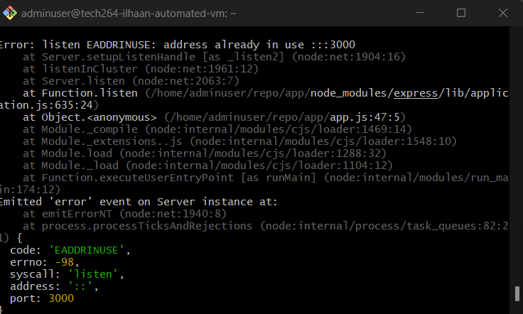

# ***Ports***
- [***Ports***](#ports)
  - [***Task: How many services can use a port?***](#task-how-many-services-can-use-a-port)
    - [***Objective***](#objective)
    - [***Step 1: Run the Sparta App***](#step-1-run-the-sparta-app)
    - [***Step 2: Open a Second Terminal and Run the App***](#step-2-open-a-second-terminal-and-run-the-app)
      - [***Expected Error***](#expected-error)
    - [***Explanation of the Error***](#explanation-of-the-error)
    - [***Step 3: Fixing the Error***](#step-3-fixing-the-error)
    - [***Option 1: Change the Port Number***](#option-1-change-the-port-number)
    - [***Option 2: Kill the Existing Process Using Port 3000***](#option-2-kill-the-existing-process-using-port-3000)
    - [***Step 4: Finding the Process Using Port 3000***](#step-4-finding-the-process-using-port-3000)
    - [***Linux Command:***](#linux-command)
    - [***Example Output***](#example-output)
    - [***Step 5: Killing the Process***](#step-5-killing-the-process)


## ***Task: How many services can use a port?***
### ***Objective***
To demonstrate the behavior of running the Sparta application in two different Git Bash terminals on the same virtual machine (VM) and resolve the resulting error due to port conflicts.
 
### ***Step 1: Run the Sparta App***
1. Open the first **Git Bash** terminal.
2. Navigate to the directory where the Sparta app is located.
3. Run the app using the command:
   ```bash
   npm start
   ```
 
### ***Step 2: Open a Second Terminal and Run the App***
1. Open a second **Git Bash** terminal.
2. Again, navigate to the directory where the Sparta app is located.
3. Attempt to run the app using the same command:
   ```bash
   npm start
   ```
 
#### ***Expected Error***
When you try to run the Sparta app in the second terminal, you will receive an error indicating that port 3000 is already in use. The error message will look something like this:
 
```
Error: listen EADDRINUSE: address already in use ::1:3000
```


### ***Explanation of the Error***
This error occurs because both instances of the Sparta app are trying to bind to the same port (3000). When the first instance is already running and listening on that port, the second instance cannot start.
 
### ***Step 3: Fixing the Error***
To resolve this issue, you have two options:
 
### ***Option 1: Change the Port Number***
1. Open the `server.js` or relevant configuration file of the Sparta app.
2. Change the port number from `3000` to another unused port (e.g., `3001`).
3. Save the changes.
4. Re-run the app in the second terminal using:
   ```bash
   npm start
   ```
 
### ***Option 2: Kill the Existing Process Using Port 3000***
If you want to run the app on port 3000, you can terminate the process currently using that port.
 
### ***Step 4: Finding the Process Using Port 3000***
To find out which process is using port 3000, you can use the following command:
 
### ***Linux Command:***
```bash
lsof -i :3000
```
 
***Explanation:***
- `lsof` lists open files and the corresponding processes.
- `-i :3000` filters the list to show only processes using port 3000.
 
### ***Example Output***
You might see output like this:
```
COMMAND   PID USER   FD   TYPE DEVICE SIZE/OFF NODE NAME
node    12345 user   23u  IPv6 0x1234      0t0  TCP *:3000 (LISTEN)
```
In this case, the `PID` (Process ID) is `12345`, which you can use to terminate the process.
 
### ***Step 5: Killing the Process***
To terminate the process using port 3000, use the `kill` command followed by the PID:
 
```bash
kill 12345
```
 
***Note:*** If the process does not terminate, you can use `kill -9` to forcefully kill it:
```bash
kill -9 12345
```


